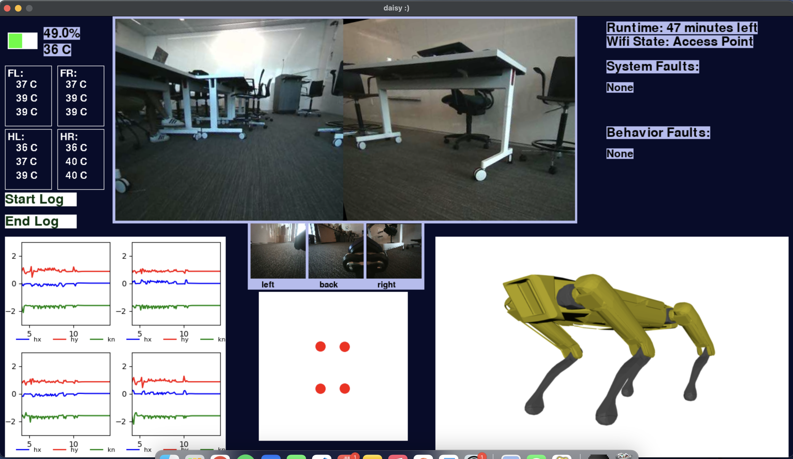
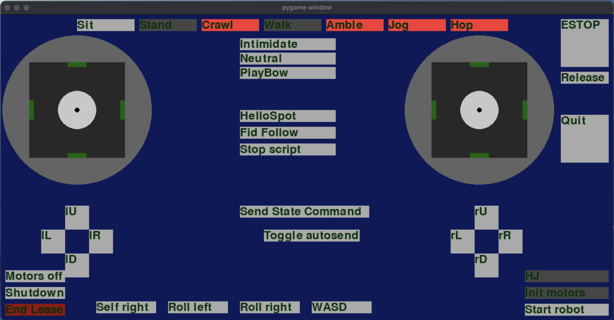

This is a repo that details my work with the Artficial Intelligence Lab at Amherst College to supplement my resume. The parent directory, which this code works within, is private. 
Still, I have tons of pictures and info that will also help you see the bigger picture!

# Daisy Control & Observer User Interfaces

A modular control and observation interface for the Boston Dynamics Spot robot, Daisy.  
This repository provides tools to directly control the robot and observe real-time data, including joint angles, camera feeds, system metrics, and faults.

---

## Overview

This project contains two primary tools:

- **Controller**: GUI interface for directly commanding the robot and running custom scripts.
- **Observer**: Dashboard for real-time visualization of Daisy’s status and telemetry.

---

## Project Structure

| File | Description |
|------|-------------|
| `Button.py` | Custom button class for Pygame UIs |
| `ClientHolder.py` | Manages Spot robot client sessions and permissions |
| `Commander.py` | Contains classes for sending commands to the robot |
| `Observer.py` | Main frontend class for the observer |
| `RobotState.py` | Interfaces robot state and mode data |
| `gui_controller.py` | Main script to launch the controller GUI |
| `gui_controller_old.py` | Legacy version of the controller |
| `gui_observer.py` | Main script to launch the observer GUI |
| `gui_observer_shell.py` | UI shell structure for the observer |
| `robot_cmds.py` | Definitions for Spot commands and controls |
| `sendCommand.py` | Placeholder for early command-sending logic |
| `utils.py` | Shared utility functions |
| `vjoystick.py` | Virtual joystick support for desktop environments |

---

## Observer

The observer provides live feedback on Daisy’s system and surroundings, including:

- Graphs of all joint angles
- Live video feeds from front and periphery cameras
- Battery status, system temperatures, Wi-Fi mode
- Real-time pose visualization with a 3D model
- Faults displayed in red when present
- Ability to record and replay sessions

### How to Run the Observer

1. **Install the required packages**:
   ```bash
   pip install -r requirements.txt
2. **Launch the observer**:
   ```bash
   python3 gui_observer.py 192.168.80.3
3. **Using the Observer GUI**:

- A window will open with Daisy’s front camera in a large panel.
- Click any smaller preview window to swap it into the main view.
- Joint angle plots update in real time for all legs.
- Battery level, sensor temperatures, Wi-Fi mode, and faults are displayed.
- Daisy’s 3D model updates live with her posture and orientation.
- Click **Record** to save all metrics to a timestamped log file in the `Continuous Logs/` directory.
- You can replay any session by loading its corresponding log file.



---

## Controller

The controller is designed to replace the Boston Dynamics tablet interface and provides:

- GUI-based connection and authentication
- Real-time custom code execution without reconnecting
- SIGQUIT handling to safely sit the robot and return control to the GUI

### How to Run the Controller

1. **Create and activate a virtual environment**:
   ```bash
   python3 -m venv venv
   source venv/bin/activate
2. **Install the required packages**:
   ```bash
   pip install -r requirements.txt
3. **Launch the controller**:
   ```bash
   python3 gui_controller.py 192.168.80.3
4. **Using the Controller GUI**:
- A window will appear. Click **Connect**.
- Then click **Authenticate** (requires a Boston Dynamics user account).
- Use the available buttons to control Daisy (e.g., stand, sit, move).
- Press **Custom Code** to run Python scripts in real time without disconnecting.
- If a custom script hangs or misbehaves, send a `SIGQUIT` signal. The robot will sit and control will return to the GUI.

> You must have a Boston Dynamics user account to control the robot.  
> You can still explore the GUI without one.


